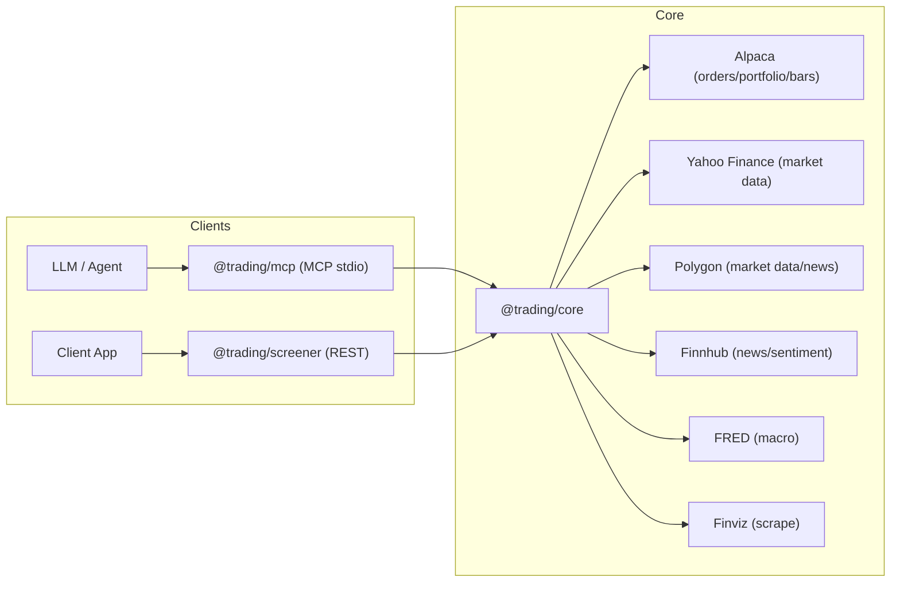

# Trading Monorepo Architecture

This document describes the current architecture of `trading-mcp` and a pragmatic path to make it more reliable, safer for trading, and easier to extend.

## Goals

- Provide **two surfaces** over shared market/trading capabilities:
  - `@trading/mcp`: Model Context Protocol (stdio) for AI tool use
  - `@trading/screener`: REST API (Hono) for programmatic clients
- Keep `@trading/core` as the **single source of truth** for:
  - types/schemas
  - provider integrations
  - trading adapter (Alpaca)
  - cross-cutting infra (timeouts, caching, rate limiting, logging)
- Be production-friendly: **typed inputs**, **predictable failure modes**, **safe-by-default trading**.

## Non-goals

- Building a full trading UI.
- Running a high-frequency trading system.
- Providing guarantees beyond what upstream providers can deliver (quotes/news can be stale or unavailable).

## System Overview

## Repository Layout

- `packages/core`: shared “platform” package
  - `src/lib`: logging, env validation, caching, rate limiting, timeouts
  - `src/providers`: market data providers + `unified` facade
  - `src/lib/alpaca.ts`: trading adapter (orders/portfolio/bars)
  - `src/schemas`, `src/types`: Zod schemas + TS types
- `packages/mcp`: MCP stdio server, exposes tools for market data, screening, portfolio, orders, technicals, options
- `packages/screener`: Hono REST API exposing quote and screener routes

## Package Responsibilities

### `@trading/core`

**Primary role:** shared domain types and integrations.

**Key modules**

- `packages/core/src/lib/alpaca.ts`: thin adapter around the official Alpaca SDK, with Zod parsing into internal types
- `packages/core/src/providers/*`: provider integrations
- `packages/core/src/providers/index.ts`: `unified` facade combining multiple sources
- `packages/core/src/lib/*`:
  - `timeout.ts`: generic request timeouts
  - `cache.ts`: LRU caches + helper
  - `rate-limiter.ts`: Bottleneck limiters + wrapper
  - `logger.ts`: Pino logger + domain children
  - `env.ts`: Zod env validation (currently not invoked by default entrypoints)

**Current provider strategy**

- `unified.getQuote(symbol)` is sequential fallback (Yahoo → Finnhub → Polygon → Finviz).
- `unified.getNews(symbol?)` aggregates across Yahoo + Finnhub + Polygon and dedupes by headline.
- `unified.healthCheck()` runs a parallel “smoke test” across providers.

### `@trading/mcp`

**Primary role:** expose capabilities to an LLM via MCP tools.

- Entry: `packages/mcp/src/index.ts` (stdio transport)
- Composition: `packages/mcp/src/server.ts` registers tools
- Tools: `packages/mcp/src/tools/*`

**Current behavior**

- Many tools use `alpaca` directly for bars/quotes/portfolio/orders (requires Alpaca keys).
- Screener tools use provider modules (Polygon when configured, otherwise Finviz).

### `@trading/screener`

**Primary role:** REST API for quotes and screening.

- Entry: `packages/screener/src/index.ts`
- App: `packages/screener/src/app.ts` (middleware + routes)
- Routes: `packages/screener/src/routes/*`
- Service: `packages/screener/src/services/screener.ts` (scan + signals)

**Current behavior**

- `GET /health` calls `unified.healthCheck()` (deep provider checks).
- Quote routes currently call `yahoo.*` directly (no provider fallback).
- Screening service currently uses `alpaca.getSnapshots/getBars` (Alpaca is required for many endpoints).

## Key Runtime Flows

### 1) “Read-only” market data (quote/bars/news)

- REST: `packages/screener/src/routes/quotes.ts` → `@trading/core` Yahoo provider
- MCP: `packages/mcp/src/tools/market.ts` → `@trading/core` Alpaca adapter
- Core: `packages/core/src/providers/index.ts` offers `unified.*` but it’s not consistently used across entrypoints

### 2) Screening

- REST: `POST /api/screener/scan` → `ScreenerService.scan()` → Alpaca snapshots/bars → compute filters/RSI/SMA
- MCP: various `get_*` screener tools → Polygon or Finviz

### 3) Trading (orders)

- MCP: `place_order` tool → `alpaca.placeOrder()` → Alpaca `createOrder`

## Cross-cutting Concerns (Current vs Desired)

### Configuration

**Current**
- `packages/core/src/config.ts` reads env at import-time and prints warnings.
- `packages/core/src/lib/env.ts` validates env with Zod but is not called by default.

**Desired**
- A single “composition root” per runnable package that:
  - calls env validation once on startup
  - constructs any clients with validated config
  - avoids import-time side effects (better tests + clearer boot behavior)

### Rate limiting and caching

**Current**
- Bottleneck limiters and LRU caches exist in `@trading/core`, but most provider calls do not consistently go through them.

**Desired**
- All external calls should be wrapped by:
  - per-provider rate limiting
  - timeouts
  - cache where safe (quotes, bars, news)

### Errors

**Current**
- Errors are often returned as `String(error)` with inconsistent shapes between MCP and REST.

**Desired**
- A small, typed error taxonomy (e.g., `ProviderError`, `ValidationError`, `NotConfiguredError`, `UpstreamUnavailableError`)
- Stable public error envelope for REST and MCP (never leak secrets; include correlation id)

### Observability

**Current**
- Pino logger exists, but REST uses `console.log` and request correlation isn’t standard.

**Desired**
- Correlation IDs across REST and MCP boundaries.
- Minimal metrics targets (latency, error rates, provider health, cache hit rate).

## Architecture Improvements (High Leverage)

### A) Establish a single “Market Data Facade”

Create a `marketData` module in `@trading/core` that is the only way the rest of the codebase fetches quotes/bars/news/options:

- provider selection + fallback lives in one place
- caching, timeouts, and rate limiting are applied uniformly
- callers (MCP tools and REST routes) stay thin and consistent

Concrete change examples:
- REST quote routes should call `marketData.getQuote(s)` instead of `yahoo.getQuote(s)`
- MCP “read-only” tools should use the same facade, reserving Alpaca for trading/portfolio

### B) Replace sequential fallback with “first-success” and health-aware routing

Today, some fallbacks are sequential. Prefer:

- parallel fan-out with timeouts
- first-success wins
- provider scoring (healthy + low latency → preferred)
- circuit breaker (temporarily stop calling a provider that’s failing)

### C) Add a trading safety layer (Policy + Two-step commit)

Trading needs guardrails beyond schema validation:

- `preview_order`: deterministic policy evaluation (market open, max notional, max qty, symbol allowlist/denylist, limit-only in extended hours, etc.)
- `execute_order`: requires a `previewId` (short TTL) and exact parameter match
- idempotency key support to prevent double submits
- (optional) audit log storage for previews/executions

This makes trading safer, testable, and explainable.

### D) Make configuration explicit and fail-fast

- Invoke `validateEnv()` in each runnable package entrypoint.
- Remove import-time config warnings and use validated config everywhere.

### E) Unify public API contracts

- REST:
  - add OpenAPI generated from Zod schemas
  - define stable error responses
- MCP:
  - return structured JSON envelopes instead of ad-hoc strings where feasible

## “How to Get Better” (Practical Roadmap)

### Phase 0 (fast wins, 1–2 days)

- Call `validateEnv()` at startup in `@trading/mcp` and `@trading/screener`.
- Route all REST quotes through `unified`/market facade to gain fallback.
- Wrap provider calls with timeouts + rate limiting + cache (quotes first).
- Add correlation IDs (header for REST; generated id for MCP tool calls) and include in logs + responses.

### Phase 1 (reliability, 2–5 days)

- Implement circuit breaker and provider scoring.
- Convert sequential fallback paths to parallel first-success.
- Add provider-level error rate tracking in memory (and expose in `/health`).

### Phase 2 (trading safety, 3–7 days)

- Implement the “preview/execute” flow + idempotency keys.
- Add an audit trail store (SQLite is enough) and a minimal “explain” endpoint/tool.

### Phase 3 (productization)

- OpenAPI + examples + client snippets.
- Load testing for common routes.
- Expand test coverage:
  - contract tests per provider adapter
  - deterministic unit tests for policy + circuit breaker behavior

## Success Metrics

Pick measurable targets so “better” is objective:

- p95 quote latency < 500ms (when at least one provider is healthy)
- < 1% 5xx on REST quote endpoints (excluding upstream outages)
- provider health reported with latency + error rate
- 80%+ unit coverage on core orchestration logic (facades, policy, breaker)

