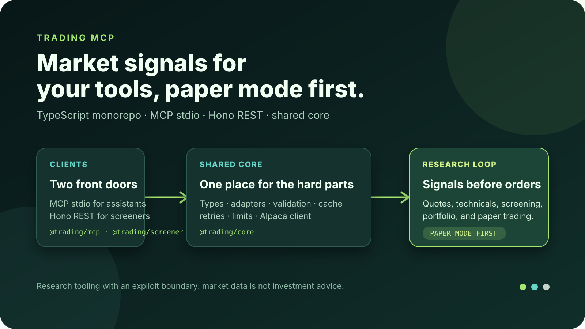

# Trading MCP · Market signals for your tools, paper mode first

[](https://github.com/aranlucas/trading-mcp/actions/workflows/ci.yml)

`trading-mcp` is a TypeScript workspace that exposes market and trading
capabilities through two clients: an MCP stdio server for AI assistants and a
Hono REST API for quotes, screening, and signals. A shared core normalizes
types, provider adapters, validation, caching, retries, rate limiting, and the
Alpaca trading client.

> **A safe research loop:** ask the MCP server for a quote or technicals, use
> the screener API to compare symbols, and inspect portfolio state with paper
> trading enabled. The same shared core keeps the clients consistent.

<p align="center">
  
</p>

This is engineering infrastructure and research tooling, not investment
advice. Market data can be delayed or unavailable, and order tools can reach a
real brokerage account when configured. Keep paper trading enabled until an
explicit, separately reviewed safety policy exists.

## Packages

- `@trading/core` — shared types, configuration, and Alpaca client.
- `@trading/mcp` — AI-assisted trading tools.
- `@trading/screener` — REST API for quotes, screening, and signals.

The MCP server includes market, portfolio, order, technical-indicator, options,
and screener tools. The REST app publishes `/api/health`,
`/api/openapi.json`, quote routes, and screener routes under `/api`.

## Run locally

```bash
pnpm install
pnpm build
```

Set `ALPACA_API_KEY`, `ALPACA_API_SECRET`, and optionally `ALPACA_PAPER=true` before using provider-backed features. Never commit credentials.

```bash
pnpm dev
pnpm dev:screener
```

The screener API serves `/api/health`, `/api/openapi.json`, quote routes, and screening routes. See [`ARCHITECTURE.md`](ARCHITECTURE.md) for deeper design notes.

## Configuration

Copy `.env.example` into your local environment. Alpaca credentials are needed
for portfolio, order, and Alpaca-backed screening features. The default
`SCREENER_PROVIDER=yahoo` keeps basic quote and daily-bar development keyless;
Polygon, Finnhub, and FRED keys enable additional provider features. Telegram
settings are only needed for the optional notification script.

| Variable | Role |
| --- | --- |
| `ALPACA_API_KEY` / `ALPACA_API_SECRET` | Alpaca account and trading API credentials. |
| `ALPACA_PAPER` | Defaults to paper mode unless explicitly set to `false`. |
| `SCREENER_PROVIDER` | `yahoo` (default) or `alpaca` for screener data. |
| `POLYGON_API_KEY`, `FINNHUB_API_KEY`, `FRED_API_KEY` | Optional provider access. |
| `PORT` | Local screener port, default `3000`. |

## Architecture and source map

```mermaid
flowchart LR
  Agent[AI assistant] --> MCP[@trading/mcp<br/>MCP stdio]
  Client[API client] --> Screener[@trading/screener<br/>Hono REST]
  MCP --> Core[@trading/core]
  Screener --> Core
  Core --> Providers[Yahoo · Polygon · Finnhub · FRED · Finviz]
  Core --> Alpaca[Alpaca orders + portfolio]
```

- `packages/core/src/providers/` contains provider adapters and the unified
  market-data facade.
- `packages/core/src/lib/` contains timeout, retry, cache, rate-limit, log,
  error, and provider-metric helpers.
- `packages/core/src/schemas/` and `src/types/` are the shared contracts.
- `packages/mcp/src/server.ts` composes tool groups in `src/tools/`.
- `packages/screener/src/app.ts` mounts quote and screener routes and emits
  OpenAPI metadata.
- `api/` and `packages/screener/api/` are Vercel adapters for the REST app.

The current provider paths are intentionally documented in
[`ARCHITECTURE.md`](ARCHITECTURE.md), including known differences between MCP
and REST data sources and the roadmap for a single market-data facade.
## Deployment

Vercel uses Corepack to honor the root package's pinned `pnpm@12.4.2`
toolchain.

## Verify

```bash
pnpm install
pnpm build
pnpm typecheck
pnpm test
pnpm lint
pnpm secretlint
```

Provider integration tests may require credentials or are skipped when they are
absent. Keep API secrets in the environment and inspect the paper/live mode
before exercising any order tool.

## Status

The monorepo is an active prototype with working MCP and REST surfaces and a
documented reliability/safety roadmap. It does not provide a trading UI,
guaranteed quotes, high-frequency execution, or a complete preview/commit
policy for live orders yet.
